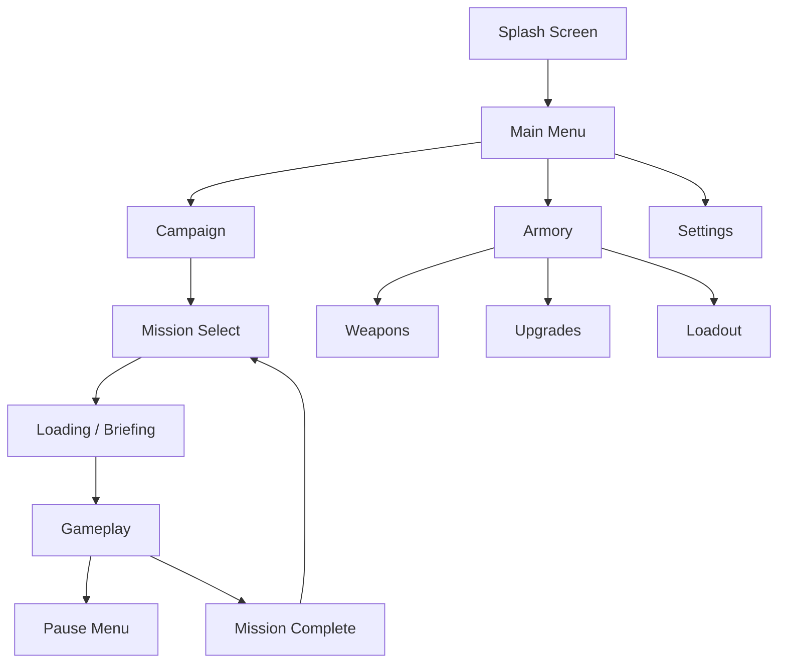

# PROJECT AETHER — Game Design Analysis (Part 2/2)
## Sections 6–10: Assets, UI/UX, Feasibility, Roadmap, Risk Analysis

---

## 6. Asset Strategy

### 6.1 Asset Pipeline

```
Blender (Creation) → glTF Export → Draco/Meshopt Compress → KTX2 Textures → Babylon.js
```

### 6.2 Modular Kit System

Build all environments from a library of **snap-together modules:**

| Kit Category | Pieces | Use |
|:--|:--|:--|
| **Walls** | Flat, angled, damaged, windowed | Corridor construction |
| **Floors** | Metal grate, plate, damaged, lit | Ground surfaces |
| **Ceilings** | Pipe rack, light panel, vent, open | Overhead detail |
| **Doors** | Sliding, blast, broken, locked | Transitions + gating |
| **Props** | Crates, consoles, barrels, debris | Cover + storytelling |
| **Connectors** | T-junctions, corners, stairs, ramps | Layout flow |

> [!TIP]
> A kit of ~40–50 modular pieces can construct 10+ visually distinct levels through re-texturing, lighting changes, and prop arrangement.

### 6.3 Asset Budgets Per Level Chunk

| Asset Type | Budget |
|:--|:--|
| Unique meshes | 15–25 |
| Unique materials | 10–20 |
| Texture memory | < 32 MB (compressed) |
| Total triangles | < 50K (visible at any time) |
| Audio clips | 10–15 ambient + SFX |

### 6.4 Character/Enemy Models

- **Hero enemies:** 2K–5K triangles each
- **Swarm enemies:** 500–1.5K triangles each
- **Player arms/weapon (first-person):** 3K–8K triangles
- **Rigging:** Simple skeleton (15–25 bones) for mobile performance
- **Animation:** Baked keyframe animations; no runtime IK

### 6.5 Audio Assets

| Type | Format | Strategy |
|:--|:--|:--|
| SFX | OGG Vorbis | Short clips, pooled playback |
| Ambience | OGG (looping) | 2–3 layered loops per environment |
| Music | OGG (streaming) | Adaptive stems, not full tracks |
| Voice | OGG (low bitrate) | Minimal VO; text preferred for size |

### 6.6 Sourcing Strategy (Solo Dev)

- **3D Models:** Procedural + Blender modular kits (self-made)
- **Textures:** Substance-style PBR from free CC0 libraries + custom edits
- **Audio:** Royalty-free SFX libraries + synthesized sci-fi elements
- **Fonts:** Google Fonts (Orbitron, Exo 2, Rajdhani for sci-fi aesthetic)

---

## 7. UI/UX Structure

### 7.1 Screen Flow



### 7.2 Implementation: HTML/CSS Overlay

All UI rendered as **HTML/CSS overlaid on the Babylon.js canvas:**

- **Why:** 3–5x faster than Babylon GUI; full CSS animations; accessible; responsive
- **How:** Absolute-positioned div over the canvas element
- **Communication:** EventBus bridges game state ↔ UI DOM updates

### 7.3 Key Screens

| Screen | Elements | Notes |
|:--|:--|:--|
| **Main Menu** | Play, Armory, Settings, Credits | Animated background (low-cost scene) |
| **Mission Select** | Chapter list, difficulty, loadout preview | Star ratings per mission |
| **HUD** | HP, ammo, minimap, crosshair, controls | Fully customizable layout |
| **Pause** | Resume, restart, settings, quit | Blurred background overlay |
| **Mission Complete** | Score, time, rewards, next mission | Upgrade teasers shown here |
| **Armory** | Weapon cards, upgrade tree, craft button | 3D weapon preview in sub-canvas |
| **Settings** | Graphics tier, audio, controls, sensitivity | Auto-detect with manual override |

### 7.4 Design Language

- **Dark-first** design (matches game atmosphere)
- **Glassmorphism** panels with subtle blur
- **Accent color:** Cyan (#00E5FF) on dark charcoal (#1A1A2E)
- **Typography:** Orbitron (headers), Exo 2 (body), monospace (data)
- **Micro-animations:** Slide-in menus, pulse on interact, glow on hover

---

## 8. Technical Feasibility Report

### 8.1 Overall Assessment

> [!IMPORTANT]
> **Verdict: FEASIBLE with constraints.** Babylon.js can deliver a corridor sci-fi FPS targeting mobile web browsers, but scope must be tightly controlled.

### 8.2 Feasibility Matrix

| Component | Feasibility | Confidence | Notes |
|:--|:--|:--|:--|
| FPS Camera + Controls | ✅ High | 95% | Well-documented Babylon.js patterns |
| Touch Input System | ✅ High | 90% | Pointer events + virtual joystick |
| Corridor Levels (glTF) | ✅ High | 95% | Modular kit + lazy loading |
| PBR Lighting | ✅ High | 90% | Baked lightmaps + minimal dynamic |
| Enemy AI (State Machine) | ✅ High | 85% | Simple FSM; ticketing limits CPU |
| Havok Physics | ✅ High | 90% | Raycasting + convex hull colliders |
| Weapon System | ✅ High | 90% | Pooled projectiles, raycasts for hitscan |
| Particle VFX | ⚠️ Medium | 75% | Must be heavily budgeted on mobile |
| Spatial Audio | ⚠️ Medium | 70% | Web Audio API limitations on Android |
| Post-Processing | ⚠️ Medium | 65% | High-end only; must be fully optional |
| Multiplayer | ❌ Cut | — | Not feasible for solo dev v1.0 |
| Open World | ❌ Cut | — | Corridor-only for performance |

### 8.3 Platform Targets

| Platform | Support Level | Min Spec |
|:--|:--|:--|
| Desktop Chrome/Firefox | Primary | Any modern GPU |
| Android Chrome | Primary | Snapdragon 665+ / 4GB RAM |
| iOS Safari | Secondary | iPhone 8+ |
| PWA (installable) | Stretch goal | Same as browser |

### 8.4 Technology Stack

```
Engine:        Babylon.js 7.x
Language:      TypeScript 5.x
Bundler:       Vite 6.x
Physics:       Havok (via @babylonjs/havok)
Audio:         Web Audio API + Howler.js
UI:            Vanilla HTML/CSS + EventBus
Compression:   Draco (geometry), KTX2 (textures)
Format:        glTF 2.0 (GLB binary)
Hosting:       Static (Vercel/Netlify/Cloudflare Pages)
```

---

## 9. Modular Development Roadmap

### Phase 0: Foundation (Weeks 1–2)
- [ ] Vite + TypeScript project setup
- [ ] Babylon.js engine wrapper with quality tiers
- [ ] Basic scene loading (empty corridor test)
- [ ] FPS camera controller with mouse/touch
- [ ] Input abstraction layer

### Phase 1: Core Loop (Weeks 3–6)
- [ ] Player movement + collision
- [ ] Hitscan weapon prototype (1 weapon)
- [ ] Basic enemy (1 type, FSM: idle → alert → combat)
- [ ] Health system (player + enemy)
- [ ] HUD overlay (HP, ammo, crosshair)
- [ ] Single test level (greybox)

### Phase 2: Combat Polish (Weeks 7–10)
- [ ] 3 weapon archetypes
- [ ] 3 enemy roles (swarm, sentinel, flanker)
- [ ] AI ticketing system
- [ ] Particle VFX (muzzle flash, hit sparks, explosions)
- [ ] Audio system (weapon SFX, footsteps, ambient)
- [ ] Hit feedback (screen flash, crosshair pulse, damage direction)

### Phase 3: Level System (Weeks 11–14)
- [ ] Modular level chunk loader
- [ ] 3 distinct corridor environments (textured, lit)
- [ ] Door/gate system + interactive terminals
- [ ] Baked lightmaps integration
- [ ] Level transition system
- [ ] Checkpoint/save system

### Phase 4: Progression & UI (Weeks 15–18)
- [ ] Weapon upgrade system (3 tiers per weapon)
- [ ] Mission select screen
- [ ] Main menu + settings
- [ ] Armory/loadout screen
- [ ] Mission complete + scoring
- [ ] Currency/blueprint economy

### Phase 5: Story & Cinematics (Weeks 19–22)
- [ ] In-engine cinematic system (camera paths + dialogue)
- [ ] 5-mission campaign arc
- [ ] Boss encounter (1 multi-phase boss)
- [ ] Environmental storytelling passes
- [ ] Narrative briefings

### Phase 6: Polish & Ship (Weeks 23–26)
- [ ] Performance profiling on real Android devices
- [ ] Quality tier auto-detection
- [ ] Bug fixing + balance tuning
- [ ] PWA manifest + Service Worker
- [ ] Analytics integration
- [ ] Launch

> [!NOTE]
> **Total estimated timeline: ~6 months** for a solo developer working full-time. Part-time doubles this estimate.

---

## 10. Risk Analysis for Solo Development

### 10.1 Risk Matrix

| Risk | Likelihood | Impact | Mitigation |
|:--|:--|:--|:--|
| **Scope creep** | 🔴 High | 🔴 Critical | Strict phase gates; cut features, not quality |
| **Android performance** | 🔴 High | 🔴 Critical | Test on low-end device every sprint; quality tiers |
| **Art asset bottleneck** | 🟡 Medium | 🔴 High | Modular kit limits unique assets needed; use CC0 |
| **Burnout** | 🟡 Medium | 🔴 High | 4-week sprints with 1-week cooldowns |
| **WebGL fragmentation** | 🟡 Medium | 🟡 Medium | Fallback shaders; test across GPU vendors |
| **Audio on mobile** | 🟡 Medium | 🟡 Medium | User-gesture unlock; Howler.js handles quirks |
| **Touch control feel** | 🟡 Medium | 🔴 High | Prototype controls FIRST (Phase 0); iterate early |
| **Save data loss** | 🟢 Low | 🟡 Medium | IndexedDB + localStorage fallback + export |
| **Browser API changes** | 🟢 Low | 🟡 Medium | Pin Babylon.js version; minimal exotic APIs |
| **Motivation loss** | 🟡 Medium | 🔴 Critical | Playable build every 4 weeks; share progress publicly |

### 10.2 Critical "Kill Zone" Decisions

These must be validated in **Phase 0–1** before committing to full development:

1. **Can touch controls feel good?** → Build and test the FPS controller on a real Android phone before anything else
2. **Can we hit 30fps on a mid-range Android?** → Run the greybox level test with 10 enemies on target hardware
3. **Is the core 30-second loop fun?** → If combat in the greybox isn't satisfying, no amount of art will save it

### 10.3 Scope Management Rules

> [!WARNING]
> **The #1 killer of solo game projects is scope creep.**

| Rule | Description |
|:--|:--|
| **One biome** | All levels use the same environmental kit (space station) |
| **Five missions** | Not 20. Five excellent missions > twenty mediocre ones |
| **No multiplayer** | Adds 3–6 months of work. Cut entirely for v1.0 |
| **No procedural gen** | Hand-crafted levels are faster and higher quality for v1 |
| **No cutscene VO** | Text + sound effects. Voice acting is expensive and slow |
| **Ship ugly, patch pretty** | Get the game loop working first; polish is the last phase |

### 10.4 Solo Dev Survival Tips

1. **Prototype the riskiest thing first** — touch controls and performance
2. **Playable every sprint** — if you can't play it, you can't evaluate it
3. **Use version control religiously** — git commit every working state
4. **Document decisions** — future-you will forget why you made choices
5. **Show people early** — feedback on a greybox is more useful than feedback on a polished failure

---

## Summary

This analysis establishes that a **corridor-based sci-fi FPS built with Babylon.js for web/mobile** is technically feasible for a solo developer within ~6 months, provided scope is aggressively managed. The design draws on proven patterns from the mobile FPS genre while remaining entirely original in concept, characters, and world-building.

**Next Steps:**
1. Review and approve this design document
2. Begin Phase 0: Foundation setup
3. Validate the "kill zone" decisions on real hardware
